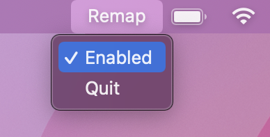

# control-to-option

A simple macOS menu bar app for switching right control to right option. Works by using [hidutil](https://developer.apple.com/library/archive/technotes/tn2450/_index.html) behind the scenes because I couldn't be bothered to dig into PyObjC.



## But why?

A few reasons:

* my [Keychron K2](https://www.keychron.com/products/keychron-k2-wireless-mechanical-keyboard) lacks a right option key
* I wanted an excuse to try out [rumps](https://github.com/jaredks/rumps)

However, instead of using this, you should probably just [use hidutil and follow the instructions here to persist the changes after reboot](https://www.reddit.com/r/Keychron/comments/pbw1pz/remapping_right_control_key_to_right_option_in_mac/).

## Building

```shell
# Install dependencies
python -m venv .venv
. .venv/bin/activate
pip install -r requirements.txt

# Create the app bundle
python setup.py py2app

# App bundle can be found in dist/
```